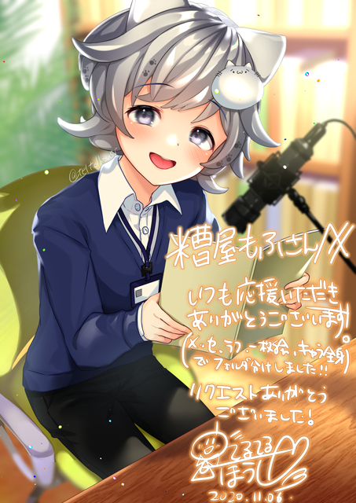
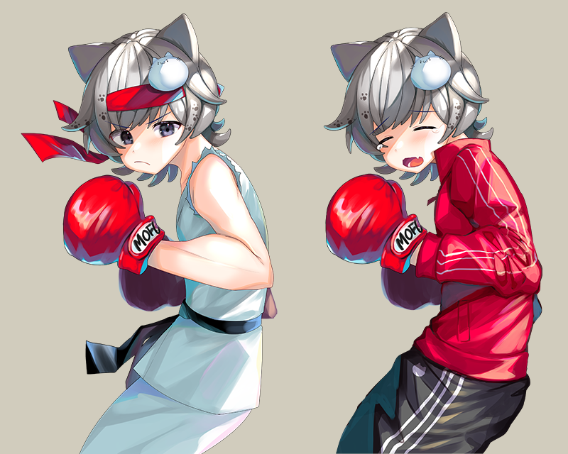

## about: てるてる法師さん

以下のサイトをご参照ください。

- 公式サイト: https://teltelhousi.mystrikingly.com/
- Twitter: https://twitter.com/teltelhousi
- Skeb: https://skeb.jp/@teltelhousi

## 糟屋もふに関する作品

### 2020/11/06 「マイクを前にして台本を読んでいる糟屋もふ」

Skebにて依頼、納品いただいたもの。

- 権利関係: てるてる法師さんに帰属。skebの利用規約による。
- 出典: https://skeb.jp/@teltelhousi/works/2
- 発表ツイート: https://twitter.com/KasuyaMofu/status/1324569500356759552


#### 依頼内容

```
こんにちは！
室内で、マイクを前にして台本を読んでいるもふさんを描いていただきたく...!
（全身絵や、着たい服は参考URLに記載しております）

サムネ等で使用可能であれば、背景透過素材もいただけると嬉しいです！

https://github.com/KasuyaMofu/backyard/issues/10
```

#### イラスト



### 2021/01/29 「ダイエット中の糟屋もふ」

メールにて依頼、納品いただいたもの。

- 権利関係: てるてる法師さんに帰属。常識的な範囲で利用可能。
- 出典: 無し(メールによる依頼)
- 発表ツイート: https://twitter.com/teltelhousi/status/1355017401205616641

#### 依頼内容

(メールでのやり取りのため非公開。)

#### イラスト


