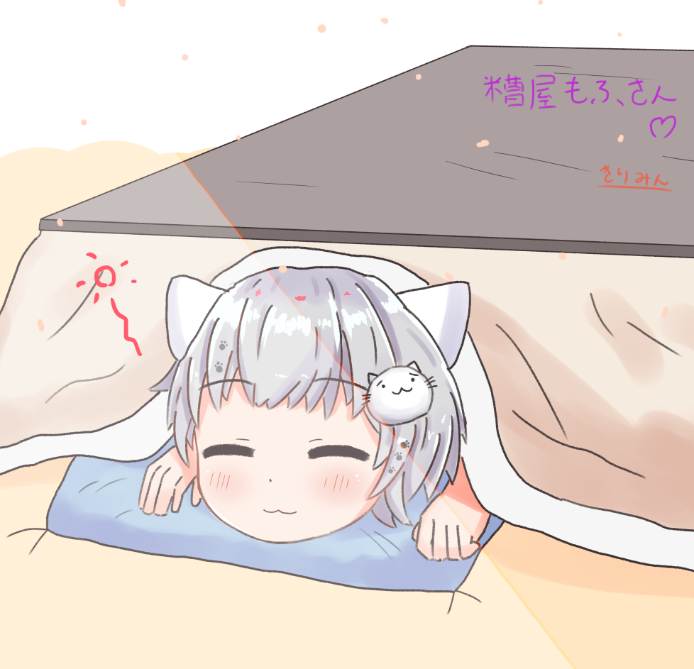

## about: きりみんちゃんさん

以下のサイトをご参照ください。

- 公式サイト: https://kirimin-chan.site/
- Twitter: https://twitter.com/kirimin_chan
- Skeb: https://skeb.jp/@kirimin_chan/works/1

## 糟屋もふに関する作品

### 2021/04/27 「こたつむり」

Skebにて依頼、納品いただいたもの。

- 権利関係: きりみんちゃんさんに帰属。Skebの利用規約による。
- 出典: https://skeb.jp/@kirimin_chan/works/1
- 発表ツイート: https://twitter.com/KasuyaMofu/status/1396657912282447872

#### 依頼内容

```
春になってもこたつを撤去できず、こたつむりになっている糟屋もふを描いてほしいです！

https://twitter.com/teltelhousi/status/1328134655137116160
```

#### イラスト

[](./20210523_kotatsu.png)
